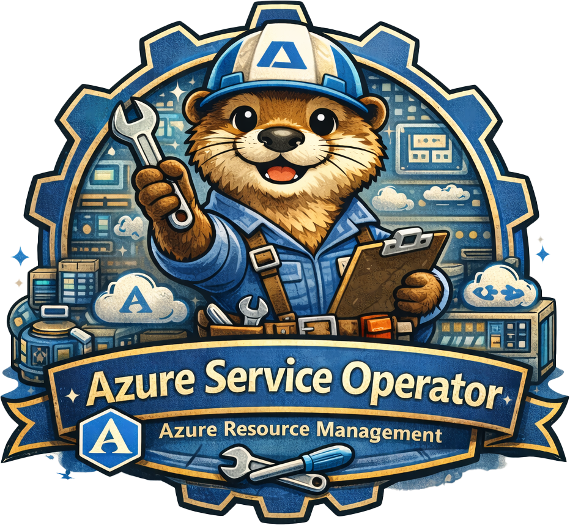

# Azure Service Operator v2
### A Deep Dive into Kubernetes-Native Azure Management
#### How ASO Bridges Kubernetes and ARM



---

# Part 1: What Is ASO v2?

---

# The Problem ASO Solves

**Traditional Azure provisioning:**
```
Developer → Terraform/Bicep → Azure ARM → Resources
                            ↓
         State file (where?)
         Drift detection (manual)
         No self-healing
```

**With ASO:**
```
Developer → Kubernetes YAML → ASO Controller → Azure ARM → Resources
                            ↓
         State in etcd (GitOps friendly)
         Continuous reconciliation
         Self-healing built-in
```

---

# ASO v2 vs v1

| Aspect | ASO v1 | ASO v2 |
|--------|--------|--------|
| Code generation | Hand-written | Auto-generated from ARM specs |
| Resource coverage | ~15 resources | 150+ resources |
| API versions | Single | Multiple per resource |
| Architecture | Per-resource controllers | Generic controller |
| Status | Deprecated | Active development |

ASO v2 generates CRDs directly from Azure's OpenAPI/Swagger specs.

---

# How Resources Are Generated

```
Azure ARM OpenAPI Specs
         ↓
    ASO Code Generator
         ↓
┌────────────────────────────────┐
│  Go Types    │  CRD YAML       │
│  (structs)   │  (schemas)      │
│      -       │      -          │
│  Conversion  │  Webhooks       │
│  Functions   │  (validation)   │
└────────────────────────────────┘
```

One generic reconciler handles ALL resource types.

---

# Part 2: Architecture

---

# High-Level Architecture

| Layer | Components |
|-------|------------|
| **Custom Resources** | StorageAccount CR, ResourceGroup CR, SQL DB CR, ... |
| **Controller** | ASO Generic Reconciler (one for all types) |
| **External** | Azure ARM REST API |

**Flow:** CR created → ASO Controller → ARM API → Azure Resource → Status updated on CR

**Key insight:** One generic controller handles ALL Azure resource types.

---

# The Generic Reconciler

Unlike typical operators with per-type controllers, ASO uses ONE reconciler:

```go
// Simplified - actual code is more complex
func (r *Reconciler) Reconcile(ctx context.Context, req ctrl.Request) {
    // 1. Get the resource (any ASO type)
    obj := r.getResource(req)

    // 2. Convert to ARM payload using generated code
    armResource := obj.ConvertToARM()

    // 3. Call Azure ARM API
    result := r.armClient.CreateOrUpdate(armResource)

    // 4. Update status from ARM response
    obj.UpdateStatusFromARM(result)
}
```

Generated code provides type-specific `ConvertToARM()` and `UpdateStatusFromARM()`.

---

# Controller Components

```
┌──────────────────────────────────────────────────────┐
│                ASO Controller Manager                │
├──────────────────────────────────────────────────────┤
│  ┌─────────────┐  ┌─────────────┐  ┌─────────────┐   │
│  │  Generic    │  │  Credential │  │   ARM       │   │
│  │  Reconciler │  │  Resolver   │  │   Client    │   │
│  └─────────────┘  └─────────────┘  └─────────────┘   │
│  ┌─────────────┐  ┌─────────────┐  ┌─────────────┐   │
│  │  Reference  │  │  Secret     │  │  Extension  │   │
│  │  Resolver   │  │  Exporter   │  │  Handlers   │   │
│  └─────────────┘  └─────────────┘  └─────────────┘   │
└──────────────────────────────────────────────────────┘
```

---

# Part 3: Resource Lifecycle

---

# Create Flow

```yaml
apiVersion: resources.azure.com/v1api20200601
kind: ResourceGroup
metadata:
  name: my-rg
  namespace: default
spec:
  location: westus2
```

```
1. User applies YAML
2. Webhook validates & defaults
3. Reconciler picks up CR
4. Converts spec → ARM JSON
5. PUT to ARM API
6. Polls for completion (async)
7. Updates status from ARM response
8. Sets Ready condition
```

---

# The ARM Polling Loop

Most Azure operations are async (long-running):

```go
func (r *Reconciler) reconcileCreate(ctx context.Context, obj Resource) {
    // Start the operation
    poller, err := r.armClient.BeginCreateOrUpdate(obj.ToARM())

    // Store operation ID in status
    obj.Status.OperationID = poller.ID()
    r.updateStatus(obj)

    // Return and requeue - don't block!
    return ctrl.Result{RequeueAfter: 15 * time.Second}
}

func (r *Reconciler) reconcilePolling(ctx context.Context, obj Resource) {
    // Resume polling
    result, done := r.armClient.Poll(obj.Status.OperationID)

    if !done {
        return ctrl.Result{RequeueAfter: 15 * time.Second}
    }

    // Operation complete - update status
    obj.UpdateStatusFromARM(result)
}
```

---

# Status and Conditions

```yaml
status:
  conditions:
    - type: Ready
      status: "True"
      reason: Succeeded
      message: Resource successfully provisioned

  # ARM resource ID
  id: /subscriptions/.../resourceGroups/my-rg

  # Provisioning state from ARM
  provisioningState: Succeeded

  # For tracking async operations
  operationId: "abc-123-..."
```

---

# Update Flow

```
1. User modifies spec
2. Reconciler detects spec change (generation changed)
3. Computes diff between desired and current ARM state
4. PATCHes only changed fields to ARM
5. Polls for completion
6. Updates status
```

**Key insight:** ASO doesn't blindly PUT the entire resource. It computes minimal patches.

---

# Delete Flow

```
1. User deletes CR (or kubectl delete)
2. Kubernetes sets deletionTimestamp
3. Finalizer blocks actual deletion
4. Reconciler sends DELETE to ARM
5. Polls until resource gone
6. Removes finalizer
7. CR disappears from etcd
```

```yaml
metadata:
  finalizers:
    - serviceoperator.azure.com/resource
```

---

# Reconciliation Triggers

ASO reconciles when:

| Trigger | What Happens |
|---------|--------------|
| CR created | Create in Azure |
| CR spec changed | Update in Azure |
| CR deleted | Delete from Azure |
| Periodic sync | Verify Azure state matches |
| Dependency ready | Unblock waiting resources |
| Secret changed | Re-authenticate if needed |

periodic sync possible: i.e. every 1 hour or 10 hours (configurable).

---

# Part 4: References and Dependencies

---

# The Owner Pattern

Resources often depend on others:

```yaml
apiVersion: storage.azure.com/v1api20210401
kind: StorageAccount
metadata:
  name: mystorageacct
spec:
  owner:
    name: my-rg  # Reference to ResourceGroup CR
  location: westus2
  sku:
    name: Standard_LRS
  kind: StorageV2
```

The `owner` field creates a dependency and ownership relationship.

---

# How References Work 

```
ResourceGroup CR ──────────┐
      │                    │
      │ owner              │ ownerReference
      ▼                    ▼
StorageAccount CR ◄────────┘
      │
      │ ARM: /subscriptions/.../resourceGroups/my-rg
      ▼
StorageAccount in Azure
```

ASO resolves the `owner` reference to get the ARM resource ID, then uses it in the ARM API call.

---

# Reference Resolution

```go
// Simplified reference resolution
func (r *Reconciler) resolveOwner(obj Resource) (string, error) {
    ownerRef := obj.Spec.Owner

    // Get the owner CR from Kubernetes
    owner := r.getResource(ownerRef.Name, ownerRef.Namespace)

    // Owner must be Ready
    if !isReady(owner) {
        return "", errors.New("owner not ready")
    }

    // Return the ARM resource ID from owner's status
    return owner.Status.ID, nil
}
```

If owner isn't ready, ASO waits and requeues.

---

# Chained Ownership

ARM resources form hierarchies. ASO mirrors this with chained `owner` references:

```
ResourceGroup → StorageAccount → BlobService → Container
```

```yaml
# Level 1: StorageAccount owned by ResourceGroup
kind: StorageAccount
spec:
  owner:
    name: my-rg

# Level 2: BlobService owned by StorageAccount
kind: StorageAccountsBlobService
spec:
  owner:
    name: my-storage

# Level 3: Container owned by BlobService
kind: StorageAccountsBlobServicesContainer
spec:
  owner:
    name: my-storage-blobservice
```

Each level waits for its parent to be Ready before provisioning.

---

# ARM ID References

For resources outside ASO management:

```yaml
spec:
  owner:
    armId: /subscriptions/xxx/resourceGroups/existing-rg
```

Use `armId` instead of `name` to reference pre-existing Azure resources.

---

# Part 5: Credentials and Authentication

---

# Credential Hierarchy

ASO looks for credentials in order:

```
1. Per-resource annotation
   └── metadata.annotations["serviceoperator.azure.com/credential-from"]

2. Per-namespace secret
   └── Secret "aso-credential" in resource's namespace

3. Global credential
   └── Configured at ASO installation time
```

First match wins.

---

# Credential Secret Format

```yaml
apiVersion: v1
kind: Secret
metadata:
  name: aso-credential
  namespace: my-namespace
type: Opaque
stringData:
  AZURE_SUBSCRIPTION_ID: "xxx-xxx-xxx"
  AZURE_TENANT_ID: "xxx-xxx-xxx"
  AZURE_CLIENT_ID: "xxx-xxx-xxx"
  AZURE_CLIENT_SECRET: "xxx-xxx-xxx"  # Service principal
```

Or for Workload Identity:

```yaml
stringData:
  AZURE_SUBSCRIPTION_ID: "xxx-xxx-xxx"
  AZURE_TENANT_ID: "xxx-xxx-xxx"
  AZURE_CLIENT_ID: "xxx-xxx-xxx"
  # No secret - uses federated token
```

---

# Multi-Tenant / Multi-Subscription

Different namespaces can target different subscriptions:

```
Namespace: team-a              Namespace: team-b
    │                              │
    ▼                              ▼
Secret: aso-credential         Secret: aso-credential
  SUBSCRIPTION: sub-A            SUBSCRIPTION: sub-B
    │                              │
    ▼                              ▼
Azure Subscription A           Azure Subscription B
```

Great for platform teams managing multiple environments.

---

# Part 6: Secrets Export

---

# Extracting Secrets from Azure

Many Azure resources have secrets (connection strings, keys):

```yaml
apiVersion: storage.azure.com/v1api20210401
kind: StorageAccount
metadata:
  name: mystorageacct
spec:
  location: westus2
  operatorSpec:
    secrets:
      key1:
        name: storage-secrets
        key: primaryKey
      connectionString:
        name: storage-secrets
        key: connectionString
```

---

# How Secret Export Works

```
StorageAccount CR
      │
      │ operatorSpec.secrets
      ▼
ASO Controller ──────► Azure: ListKeys API
      │
      │ Creates/Updates
      ▼
Kubernetes Secret
  name: storage-secrets
  data:
    primaryKey: xxx
    connectionString: xxx
```

ASO calls Azure APIs to fetch secrets, then writes them to Kubernetes Secrets.

---

# Secret Export Patterns

```yaml
operatorSpec:
  secrets:
    # Export to specific keys
    key1:
      name: my-secret
      key: storage-key

    # Export connection string
    connectionString:
      name: my-secret
      key: conn-str

  # Or export entire config to ConfigMap
  configMaps:
    primaryEndpoints:
      name: storage-config
      key: endpoints
```

---

# Part 7: Advanced Features

---

# Resource Import

Adopt existing Azure resources into ASO management:

```yaml
apiVersion: resources.azure.com/v1api20200601
kind: ResourceGroup
metadata:
  name: imported-rg
  annotations:
    serviceoperator.azure.com/reconcile-policy: manage
spec:
  azureName: my-existing-rg  # Name in Azure (if different)
  location: westus2
```

ASO will import the resource and begin managing it.

Note: `azureName` lets the CR name differ from the Azure resource name.

---

# Reconcile Policies

Control what ASO does:

| Policy | Behavior |
|--------|----------|
| `manage` | Full control (default) - create, update, delete |
| `skip` | Don't reconcile - useful for debugging or pure data source |
| `detach-on-delete` | Delete CR without deleting Azure resource |

```yaml
metadata:
  annotations:
    serviceoperator.azure.com/reconcile-policy: detach-on-delete
```

---

# CEL Expressions for Config

Dynamic configuration using CEL:

```yaml
spec:
  operatorSpec:
    configMapExpressions:
      - name: dynamic-config
        key: endpoint
        value: self.status.primaryEndpoints.blob
```

CEL expressions can reference `self` (the resource) to compute values.

---

# Cross-Resource References with CEL

```yaml
apiVersion: dbforpostgresql.azure.com/v1api20210601
kind: FlexibleServer
spec:
  administratorLoginPassword:
    type: expression
    value: secret.data["password"]  # Reference another secret
    secretRef:
      name: db-credentials
```

---

# Part 8: Watching It Work

---

# Common Status Conditions

| Condition | Meaning |
|-----------|---------|
| `Ready=True` | Resource fully provisioned |
| `Ready=False, Reason=Reconciling` | Operation in progress |
| `Ready=False, Reason=AzureError` | ARM API returned error |
| `Ready=False, Reason=ReferenceNotFound` | Owner/reference missing |
| `Ready=False, Reason=CredentialError` | Auth failed |

---

# Debugging: Resource Events

```bash
kubectl describe storageaccount mystorageacct
```

```
Events:
  Type     Reason                Age   Message
  ----     ------                ----  -------
  Normal   BeginCreateOrUpdate   1m    Starting async operation
  Normal   PollingComplete       30s   Operation completed
  Normal   Ready                 30s   Resource is Ready
```

Or for errors:

```
Events:
  Type     Reason       Age   Message
  ----     ------       ----  -------
  Warning  AzureError   10s   StorageAccountAlreadyTaken: The storage
                              account named xxx is already taken.
```

---

# Part 9: Best Practices

---

# Naming Conventions

```yaml
metadata:
  name: myapp-dev-storage  # Kubernetes name (can be anything)
spec:
  azureName: myappdevstorage  # Azure name (must follow Azure rules)
```

- Kubernetes names: lowercase, hyphens allowed
- Azure names: vary by resource (storage = no hyphens)
- Use `azureName` when they need to differ

---

# Resource Dependencies

Always ensure proper ordering:

```yaml
# 1. ResourceGroup first
apiVersion: resources.azure.com/v1api20200601
kind: ResourceGroup
metadata:
  name: my-rg

# 2. StorageAccount references ResourceGroup
apiVersion: storage.azure.com/v1api20210401
kind: StorageAccount
metadata:
  name: my-storage
spec:
  owner:
    name: my-rg  # ASO waits for this to be Ready
```

ASO handles ordering automatically via owner references.

---

# Handling Sensitive Data

```yaml
# DON'T do this
spec:
  administratorLoginPassword: "plaintext-bad!"

# DO this - reference a Secret
spec:
  administratorLoginPassword:
    name: db-credentials
    key: password
```

ASO supports `SecretReference` for sensitive fields.

---

# Part 10: Common Gotchas

---

# Gotcha: Resource Already Exists

```
AzureError: Resource already exists and was not created by ASO
```

**Solution:** Use `reconcile-policy: manage` to adopt it:

```yaml
metadata:
  annotations:
    serviceoperator.azure.com/reconcile-policy: manage
spec:
  azureName: existing-resource-name
```

---

# Gotcha: Credential Not Found

```
CredentialError: No credential found for resource
```

**Check:**
1. Secret exists in resource's namespace?
2. Secret named `aso-credential`?
3. Required keys present (`AZURE_SUBSCRIPTION_ID`, etc.)?

```bash
kubectl get secret aso-credential -n my-namespace -o yaml
```

---

# Gotcha: Owner Not Ready

```
ReferenceNotFound: Owner my-rg is not Ready
```

**Cause:** Referenced resource hasn't finished provisioning.

**Solution:** Wait, or check the owner's status:

```bash
kubectl describe resourcegroup my-rg
```

---

# Gotcha: Immutable Field Changed

```
AzureError: Cannot change property 'location' after creation
```

Some Azure properties are immutable. ASO can't change them.

**Solution:** Delete and recreate, or use a new resource name.

---

# Summary

| Concept | Key Point |
|---------|-----------|
| Architecture | One generic reconciler, generated code per type |
| Lifecycle | Async polling, finalizers for cleanup |
| References | `owner` creates dependencies, resolves ARM IDs |
| Credentials | Hierarchical: annotation → namespace → global |
| Secrets | `operatorSpec.secrets` exports to K8s Secrets |
| Adoption | `reconcile-policy: manage` + `azureName` |

---

# Questions?

---

