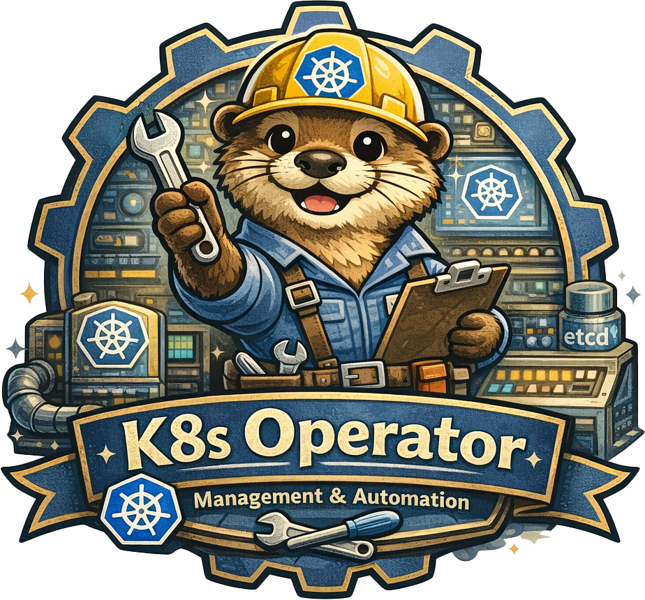
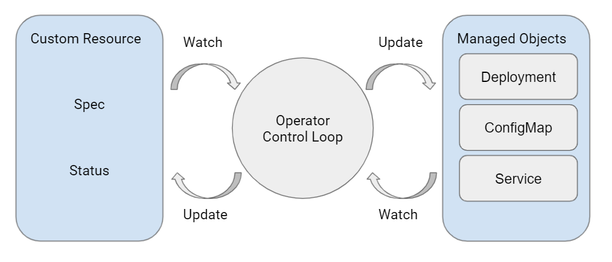

# Kubernetes Internals
### From YAML to Reconciliation
#### A Deep Dive for Future Operator Developers



---

# Part 1: The Kubernetes Philosophy

---

# What is an Operator?



---

# Kubernetes is a Declarative API

Kubernetes is **not** a system where users execute steps.

Kubernetes is an HTTP API that stores **desired state**.

Users declare intent by writing objects.
Controllers continuously reconcile actual state toward that intent.

---

# Desired State vs Observed State

Every Kubernetes object has two separate realities:

| Field | Written by | Purpose |
|-------|-----------|---------|
| **spec** | Users or automation | Desired state |
| **status** | Controllers | Observed state |

These are **not guaranteed to match**.

Controllers exist to reduce the gap between spec and reality.
Reconciliation is continuous and never ends.

---

# Reconciliation Is Level-Triggered

Controllers do **not** react to events directly.
They continuously evaluate whether current state matches desired state.

```
Edge-triggered: "A pod was created" → do something
Level-triggered: "There should be 3 pods, there are 2" → create one
```

Events only signal that reconciliation *may* be needed.
Correctness is defined by **state**, not by events.

---

# Part 2: Objects and Identity

---

# GVK vs GVR

**Why this matters:** You'll use both, and mixing them up causes confusing errors.

**GVK** (Group, Version, Kind):
- Defines the schema and meaning of an object
- Used in YAML manifests: `kind: Deployment`
- Example: `apps/v1 Deployment`

**GVR** (Group, Version, Resource):
- Defines the REST endpoint (usually lowercase plural of Kind)
- Used by informers, RBAC, and API paths
- Example: `apps/v1/deployments`

```
YAML uses Kind:     kind: Deployment
RBAC uses Resource: resources: ["deployments"]
API path:           /apis/apps/v1/namespaces/default/deployments
```

Controllers and informers operate on **resources**, not kinds.

Note: **How kubectl translates GVK → GVR:** When you run `kubectl apply -f deployment.yaml`, kubectl reads the `apiVersion` and `kind` from the YAML (GVK). It then queries the API server's discovery endpoint (`/apis/apps/v1`) which returns a list of all registered resource types including their `name` (plural), `kind`, and `verbs`. kubectl caches this in `~/.kube/cache/discovery/`. The RESTMapper uses this data to map `Kind: Deployment` → `Resource: deployments`, then constructs the REST path: `/apis/apps/v1/namespaces/default/deployments`. Run `kubectl api-resources` to see all Kind→Resource mappings the cluster supports (this is the discovery data, not instances you've created).

---

# Object Identity and Metadata

Objects are identified by:

| Identifier | Purpose | Reusable? |
|-----------|---------|-----------|
| `namespace/name` | API address | Yes |
| `UID` | Immutable identity | No |

Names can be reused after deletion.
UIDs cannot.

Controllers **must** use UID for ownership and identity comparisons.

---

# Namespace-Scoped vs Cluster-Scoped

**Namespace-scoped:** Pods, Services, Deployments, ConfigMaps
- Isolated within a namespace
- Name uniqueness only within namespace

**Cluster-scoped:** Nodes, Namespaces, ClusterRoles, PVs
- Global across the cluster
- Name must be globally unique

**Important for operators:**
- Your CRD can be either — choose based on use case
- Cluster-scoped operators need cluster-wide RBAC

---

# resourceVersion vs generation

**resourceVersion**:
- Changes on every write (spec, status, labels, anything)
- Used for optimistic concurrency and watches
- Must **never** be stored or reused

**generation**:
- Increments only when spec changes (not all fields — some are excluded)
- Allows controllers to detect meaningful changes

**status.observedGeneration**:
- Indicates whether status reflects the current spec
- Controllers must update this to avoid lying status

<small>New APIs should use spec, not annotations, for configuration.</small>

---

# Quick Check: Objects and Identity

**Q1:** A controller uses `name` instead of `UID` to track ownership. What can go wrong?

**Q2:** Your controller checks if it already processed a spec change. Should it compare `resourceVersion` or `generation`?

Note:
A1: If the resource is deleted and recreated with the same name, the controller thinks it owns the new resource (but it doesn't — different UID).
A2: Use `generation`. Compare `status.observedGeneration` with `metadata.generation` to detect unprocessed spec changes. `resourceVersion` changes on every write (including status), causing unnecessary reconciles.

---

# Part 3: The API Server Pipeline

---

# API Server Request Lifecycle

Every request follows this pipeline:

```
Request
   ↓
Authentication       → Who is this?
   ↓
Authorization        → Can they do this? (RBAC)
   ↓
Conversion           → Convert between CRD versions (if needed)
   ↓
Mutating Admission   → Modify the request (webhooks, defaults)
   ↓
Validating Admission → Reject invalid requests (webhooks)
   ↓
Schema Validation    → Does it match the CRD/type?
   ↓
Persistence          → Write to etcd
   ↓
Watch Notifications  → Inform all watchers
```

Controllers only see objects that successfully reach etcd.

---

# LIST and WATCH

Controllers do not poll blindly.

They use:
- **LIST** to establish baseline state
- **WATCH** to receive incremental changes

```
LIST /api/v1/pods → [pod1, pod2, pod3], resourceVersion=1000
WATCH /api/v1/pods?resourceVersion=1000 → stream of changes
```

Ordering is guaranteed per resourceVersion.
Watches **will** break eventually.
`410 Gone` means a re-LIST is required.

---

# Part 4: Object Lifecycle

---

# Deletion Is a State

Deletion is **not** immediate.

A delete request:
1. Sets `deletionTimestamp`
2. Triggers finalizers
3. Delays actual removal

Objects can exist in a "being deleted" state **indefinitely**.

```yaml
metadata:
  deletionTimestamp: "2024-01-15T10:30:00Z"  # ← Being deleted
  finalizers:
    - my-controller/cleanup                   # ← Blocking deletion
```

Controllers must explicitly handle this state.

---

# Finalizers

Finalizers prevent deletion until cleanup is complete.

**Scenario:** Your CRD provisions an S3 bucket. User deletes the CRD.
- Without finalizer → bucket orphaned forever, costs money
- With finalizer → controller deletes bucket first, then allows CRD removal

**Required for:**
- External resource cleanup (cloud resources, DNS records)
- Ordered teardown of dependencies

---

# Finalizers

**The full pattern:**
```go
// 1. Add finalizer on create (if not present)
if !controllerutil.ContainsFinalizer(obj, myFinalizer) {
    controllerutil.AddFinalizer(obj, myFinalizer)
    return r.Update(ctx, obj)
}

// 2. Handle deletion
if !obj.DeletionTimestamp.IsZero() {
    if err := r.cleanupExternalResources(obj); err != nil {
        return ctrl.Result{}, err
    }
    controllerutil.RemoveFinalizer(obj, myFinalizer)
    return ctrl.Result{}, r.Update(ctx, obj)
}
```

Finalizers **must** always be removable. Stuck finalizers = stuck namespaces.

---

# Ownership and Garbage Collection

OwnerReferences define lifecycle dependency.

**Rules:**
- Ownership is bound by **UID**, not name
- Only **one** controller owner is allowed (`controller: true`)
- Garbage collection is **asynchronous**
- **ownerReferences cannot cross namespaces**

**Propagation policies:**
| Policy | Behavior |
|--------|----------|
| `Background` | Delete owner, GC deletes children later |
| `Foreground` | Children deleted first, then owner (requires `blockOwnerDeletion: true`) |
| `Orphan` | Children survive owner deletion |

Ownership mistakes cause **mass deletion** or **resource leaks**.

---

# Orphaning and Adopting Resources

**Orphaning:** Resources without an owner (or owner deleted with `Orphan` policy)
- Orphaned resources continue to exist but are no longer managed
- Can cause resource leaks if not cleaned up manually

**Adoption:** Controller claims ownership of existing resources
- Done by adding `ownerReferences` to orphaned objects
- Used by ReplicaSet to adopt matching Pods it didn't create

**Dangers of adoption:**
- Broad label selectors can accidentally adopt unrelated resources
- Adopted resources get deleted when the owner is deleted
- Multiple controllers fighting over the same resource

---

# Quick Check: Object Lifecycle

**Q1:** An object has `deletionTimestamp` set but still exists. Why?

**Q2:** Can a Pod in namespace "dev" be owned by a Deployment in namespace "prod"?

**Q3:** You delete a Deployment. Its Pods disappear 30 seconds later. Why the delay?

Note:
A1: Finalizers are blocking deletion. The controller hasn't finished cleanup yet.
A2: No. ownerReferences cannot cross namespaces.
A3: Garbage collection is asynchronous (Background propagation by default).

---

# Part 5: The Controller Runtime

---

# Informers and Caches

Controllers never read directly from the API server.

```
API Server → Informer → Local Cache → Controller
                           ↑
          LIST + WATCH
```

**Benefits:**
- Reduced API server load
- Fast local reads
- Event-driven reconciliation

**Consequence:**
- Cache may be stale
- Writes go to API server, reads from cache
- Watch bookmark events help maintain consistency

Note:
Bookmark events are periodic events from the API server containing only a resourceVersion (no object data). They keep the client's "last seen" resourceVersion fresh even during quiet periods. Without bookmarks, if no objects change for hours, your resourceVersion becomes stale. When the watch breaks, etcd may have compacted that old version → 410 Gone → expensive full re-LIST.

---

# Watching Secondary Resources

Controllers often need to react to changes in resources they don't own.

**Example:** Your CRD creates a Deployment. Update status when Pods become ready.

```go
ctrl.NewControllerManagedBy(mgr).
    For(&myv1.MyApp{}).
    Owns(&appsv1.Deployment{}).  // Owned resources - auto-mapped
    Watches(                      // Non-owned resources - manual mapping
        &corev1.Pod{},
        handler.EnqueueRequestsFromMapFunc(r.findAppsForPod),
    )

func (r *Reconciler) findAppsForPod(ctx context.Context,
    pod client.Object) []reconcile.Request {
    // Find MyApp that owns the Deployment that owns this Pod
}
```

`Owns()` for direct children, `Watches()` for indirect dependencies.

---

# Workqueues and Deduplication

Workqueues store **keys**, not events.

```
Event: Pod A updated     ┐
Event: Pod A updated     ├→ Queue: ["default/pod-a"]
Event: Pod A deleted     ┘
```

**Properties:**
- Multiple events collapse into one reconcile
- A key is processed by only one worker at a time
- Retries use **exponential backoff** (5s, 10s, 20s... up to 16min)

**Requeue behaviors:**
| Return | Behavior |
|--------|----------|
| `Result{}, nil` | Done, no requeue |
| `Result{Requeue: true}, nil` | Immediate requeue (danger: hot loop!) |
| `Result{RequeueAfter: 5m}, nil` | Requeue after duration |
| `Result{}, err` | Requeue with exponential backoff |

---

# Workqueue Internals

The workqueue uses 3 data structures:

| Structure | Type | Purpose |
|-----------|------|---------|
| **queue** | FIFO | Items waiting to be processed |
| **dirty** | Set | Items that need processing (deduplication) |
| **processing** | Set | Items currently being worked on |

**How it works:**
1. Event arrives → key added to `dirty` (deduped), added to `queue` if not in `processing`
2. Worker calls `Get()` → key removed from `dirty`, moved to `processing`
3. Worker calls `Done()` → if key in `dirty` (event arrived during processing), re-queue it

```
Event: Pod A updated  → dirty: {A}, queue: [A], processing: {}
Worker takes A        → dirty: {}, queue: [], processing: {A}
Event: Pod A updated  → dirty: {A}, queue: [], processing: {A}  # Not queued!
Worker done with A    → dirty: {}, queue: [A], processing: {}   # Re-queued
```

---

# Part 6: Writing Reconcile

---

# What Does This Code Do?

```go
func (r *Reconciler) Reconcile(ctx context.Context, req ctrl.Request) (ctrl.Result, error) {
    var cm corev1.ConfigMap
    if err := r.Get(ctx, req.NamespacedName, &cm); err != nil {
        if apierrors.IsNotFound(err) {
           return ctrl.Result{}, nil
        }
        return ctrl.Result{}, err
    }
    return ctrl.Result{}, nil
}
```

This is the **minimal** reconcile function:
1. Receives a key (`req.NamespacedName`)
2. Fetches current state from cache
3. Handles "object deleted" case
4. Returns (does nothing else yet)

---

# Reconcile Is the Only Brain

Reconcile receives a **key**, not an event.

It must:
1. Read current state from cache
2. Compare desired vs observed
3. Make **idempotent** changes
4. Update status
5. Handle deletion (check `deletionTimestamp`)

**Critical:** Reconcile must be **stateless**.
- Don't store state between reconciles
- Always re-read from cache
- Each call should work independently

Reconcile must tolerate retries and partial failure.

---

# Status and Conditions

Status is **output only**.

Controllers must:
- Report progress and failures
- Use conditions consistently (use `meta.SetStatusCondition`)
- **Never** drive behavior from status

```go
meta.SetStatusCondition(&obj.Status.Conditions, metav1.Condition{
    Type:               "Ready",
    Status:             metav1.ConditionTrue,
    Reason:             "AllReplicasAvailable",
    Message:            "3/3 replicas are ready",
    ObservedGeneration: obj.Generation,
})
obj.Status.ObservedGeneration = obj.Generation
```

Spec defines intent. Status reports reality.

---

# Quick Check: Writing Reconcile

**Q1:** Your controller receives 10 events for the same Pod in 1 second. How many Reconcile calls?

**Q2:** Your Reconcile increments a counter each call to track "retries". After a pod restart, the counter is 0 but the object still exists. What went wrong?

**Q3:** Reconcile returns `Result{Requeue: true}` in a loop. What happens?

Note:
A1: Just 1 (probably). Workqueue deduplicates by key — multiple events collapse.
A2: Reconcile must be stateless. In-memory state is lost on restart. Use status or annotations to persist state.
A3: Hot loop! CPU spins. Use `RequeueAfter` or return an error for backoff instead.

---

# Part 7: Production Concerns

---

# Leader Election

Operators typically run multiple replicas for HA.
**Only one should reconcile at a time.**

```go
// In main.go
mgr, err := ctrl.NewManager(cfg, ctrl.Options{
    LeaderElection:   true,
    LeaderElectionID: "my-operator-lock",
})
```

**Without leader election:**
- Multiple instances reconcile the same objects
- Race conditions and conflicts
- Duplicate external resource creation

Leader election uses a Lease object in the cluster.

---

# Part 8: Failure Modes

---

# Common Operator Failures

| Failure | Root Cause |
|---------|------------|
| Acting on events instead of state | Misunderstanding level-triggered |
| Non-idempotent reconcile logic | Not safe to retry |
| Forgetting deletion handling | Objects get stuck |
| Stuck finalizers | Cleanup code fails or isn't reachable |
| Multiple owners | Ownership conflict |
| Broad adoption selectors | Accidentally adopting wrong objects |
| Lying status | Not updating observedGeneration |
| Ignoring 409 Conflicts | Not using retry logic or SSA |
| Storing state in memory | Reconcile should be stateless |
| Missing leader election | Multiple instances fighting |
| Cross-namespace ownership | ownerReferences can't cross namespaces |

---

# The Golden Rules

1. **Reconcile state, not events** — always re-read current state
2. **Be idempotent** — running twice should be safe
3. **Be stateless** — don't store state between reconciles
4. **Handle deletion first** — check `deletionTimestamp` early
5. **Own cleanup** — finalizers must always be removable
6. **Tell the truth** — status must reflect reality
7. **Handle conflicts** — use retry logic or Server-Side Apply
8. **Expect failure** — network, API server, your code will fail
9. **Periodic sync** — by default, every 10h all resources get reconciled

---

# Summary

```
YAML → API Server → etcd → Watch → Informer → Queue → Reconcile
                                                                        ↓
                                                            Compare spec vs reality
                                                                        ↓
                                                            Make idempotent changes
                                                                        ↓
                                                                  Update status
```

You don't write event handlers.
You write a function that makes reality match intent.

---

# Questions?

---

# Appendix

---

# (Other) types of operators

- Event-Driven (Watch-Based) Operators
    - Reacts to kubernetes events
- Time-Driven (Polling / RequeueAfter) Operators
    - Runs periodically regardless of events 
    - `Reconcile → RequeueAfter(30s) → Reconcile → …`
- Hybrid Operators (Event + Time Driven)
    - Event-driven for Kubernetes resources
    - Time-driven for external dependencies
- Step-Based / Phase-Driven Operators
    - Spec or Status contains a “phase” field
    - Reconcile advances phases step by step
- One-Shot / Batch Operators
    - Once and never more
    - Migrations, cleanup, bootstrap

<b>Reconcile must converge from any state to the desired state, regardless of how it was triggered.</b>

---

# Adoption Example: ApplicationNamespace

**Scenario:** You have pre-existing Namespaces. You create a cluster-scoped `ApplicationNamespace` CRD to manage them.

```go
func (r *Reconciler) Reconcile(ctx context.Context, req ctrl.Request) (ctrl.Result, error) {
    var appNs myv1.ApplicationNamespace
    if err := r.Get(ctx, req.NamespacedName, &appNs); err != nil {
        return ctrl.Result{}, client.IgnoreNotFound(err)
    }

    // Check if the namespace already exists
    var ns corev1.Namespace
    err := r.Get(ctx, client.ObjectKey{Name: appNs.Spec.NamespaceName}, &ns)

    if apierrors.IsNotFound(err) {
        // Create new namespace with ownership
    }

    // Namespace exists - adopt it if not already owned
    if !metav1.IsControlledBy(&ns, &appNs) {
        if err := ctrl.SetControllerReference(&appNs, &ns, r.Scheme); err != nil {
            return ctrl.Result{}, err
        }
        return ctrl.Result{}, r.Update(ctx, &ns)  // Adds ownerReference
    }

    return ctrl.Result{}, nil
}
```

Note: This works because both `ApplicationNamespace` and `Namespace` are cluster-scoped. The `ctrl.SetControllerReference` helper sets the ownerReference with `controller: true`. After adoption, deleting the ApplicationNamespace will garbage-collect the Namespace too - warn users about this behavior!

---

# Phased Operator Example: Storage + KeyVault CMK

**Scenario:** Create a StorageAccount, wait for its system-assigned identity, then use that identity to configure Customer Managed Keys on a KeyVault.

```
┌─────────────────┐     ┌─────────────────┐     ┌─────────────────┐
│  Phase 1        │     │  Phase 2        │     │  Phase 3        │
│  Create Storage │ ──► │  Wait for       │ ──► │  Configure CMK  │
│  Account with   │     │  Identity       │     │  with Identity  │
│  SystemAssigned │     │  PrincipalId    │     │  on KeyVault    │
└─────────────────┘     └─────────────────┘     └─────────────────┘
       ▲                                                                   │
       └───────────────── Requeue ─────────────────────┘
```

Each reconcile picks up where it left off - level-triggered!

---

# Phased Operator: The Code

```go
func (r *Reconciler) Reconcile(ctx context.Context, req ctrl.Request) (ctrl.Result, error) {
    var app myv1.SecureStorage
    if err := r.Get(ctx, req.NamespacedName, &app); err != nil {
        return ctrl.Result{}, client.IgnoreNotFound(err)
    }

    // Phase 1: Ensure StorageAccount exists with SystemAssigned identity
    sa, err := r.ensureStorageAccount(ctx, &app)
    if err != nil {
        return ctrl.Result{}, err
    }

    // Phase 2: Wait for Azure to provision the identity
    if sa.Status.Identity == nil || sa.Status.Identity.PrincipalId == "" {
        log.Info("waiting for storage account identity to be provisioned")
        return ctrl.Result{RequeueAfter: 30 * time.Second}, nil
    }

    // Phase 3: Configure KeyVault access policy with the identity
    if err := r.ensureKeyVaultAccess(ctx, &app, sa.Status.Identity.PrincipalId); err != nil {
        return ctrl.Result{}, err
    }

    // Phase 4: Enable CMK on storage account
    if err := r.enableCMK(ctx, sa, &app); err != nil {
        return ctrl.Result{}, err
    }

    return ctrl.Result{}, nil
}
```

Note: Key patterns here: (1) Each phase is idempotent - safe to re-run. (2) We return `RequeueAfter` when waiting for external state, not a tight loop. (3) Status checks gate progression - if identity isn't ready, we stop and wait. (4) On next reconcile, phases 1-2 are no-ops if already complete, we proceed to phase 3. This is level-triggered in action: we don't track "which phase we're on" - we compute it from observed state every time.

---

# Handling Conflicts

Concurrent updates cause `409 Conflict` errors. This is normal.

**Solution 1: Retry on conflict**
```go
err := retry.RetryOnConflict(retry.DefaultRetry, func() error {
    if err := r.Get(ctx, key, &obj); err != nil {
        return err
    }
    obj.Spec.Field = newValue
    return r.Update(ctx, &obj)
})
```

**Solution 2: Server-Side Apply (preferred)**
```go
obj.Spec.Field = newValue
err := r.Patch(ctx, &obj, client.Apply, client.FieldOwner("my-controller"))
```

**Never** store resourceVersion and reuse it across reconciles.

---

# Server-Side Apply (SSA)

The modern way to update resources. Avoids many conflict issues.

**Benefits:**
- Automatic conflict detection per field
- Multiple controllers can own different fields
- No need to read-modify-write

```go
// Declare only the fields you care about
desired := &corev1.ConfigMap{
    ObjectMeta: metav1.ObjectMeta{Name: "my-cm", Namespace: "default"},
    Data:       map[string]string{"key": "value"},
}
err := r.Patch(ctx, desired, client.Apply,
    client.FieldOwner("my-controller"),
    client.ForceOwnership)
```

**Recommendation:** Use SSA for creating/updating owned resources. 

Notes: 
Why SSA reduces conflicts

With SSA, if:
- your controller owns `.spec.fieldA`
- another controller owns `.spec.fieldB`
Both can update independently without clobbering each other.
Conflicts occur only if two managers try to own the same field.

When to use which
Use RetryOnConflict when:
- you are doing classic Update() on a resource you fully control
- you need to compute a new value based on the latest full object
- SSA is not practical (rare today)

Use SSA (preferred) when:
- creating/updating child resources your controller owns
- you want to avoid clobbering unrelated fields
- you want safer multi-writer behavior

A very practical controller guideline

For owned child objects (Deployments/Services/ConfigMaps you create):

- Use SSA apply patch
- Use a stable field manager name
- Use ForceOwnership only if you truly own the object

For updating the parent CR status:

Prefer Status().Patch(...) (often merge patch), and handle conflicts normally
(SSA for status is possible but less commonly used depending on patterns)
---